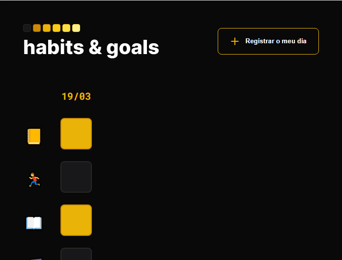
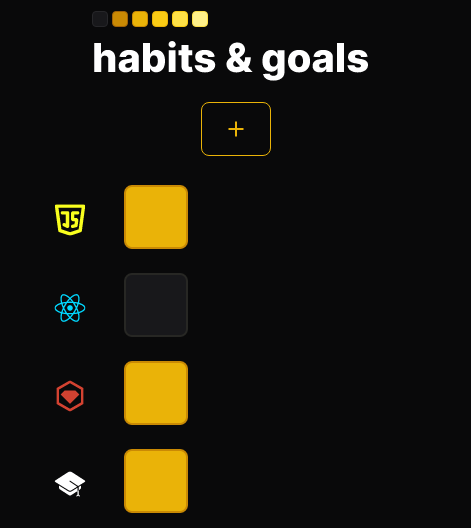

<h1 align="center"> Habits & Goals </h1>

Controle de hábitos e metas.
 

  <a href="#-tecnologias">Tecnologias</a>&nbsp;&nbsp;&nbsp;|&nbsp;&nbsp;&nbsp;
  <a href="#-projeto">Projeto</a>&nbsp;&nbsp;&nbsp;&nbsp;&nbsp;&nbsp;

 

  
    
  

## 🚀 Tecnologias

Esse projeto foi desenvolvido com as seguintes tecnologias:

- HTML e CSS
- JavaScript
- Git e Github

## 💻 Projeto

Aplicativo de controle de hábitos e metas.

## 🖱️ Visite

https://jonathafernandes.github.io/habits-e-goals/

---
👨‍💻 Desenvolvedor
 
- Jonatha Fernandes
